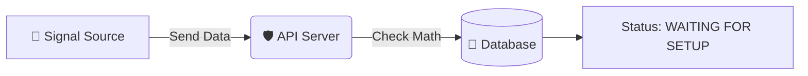
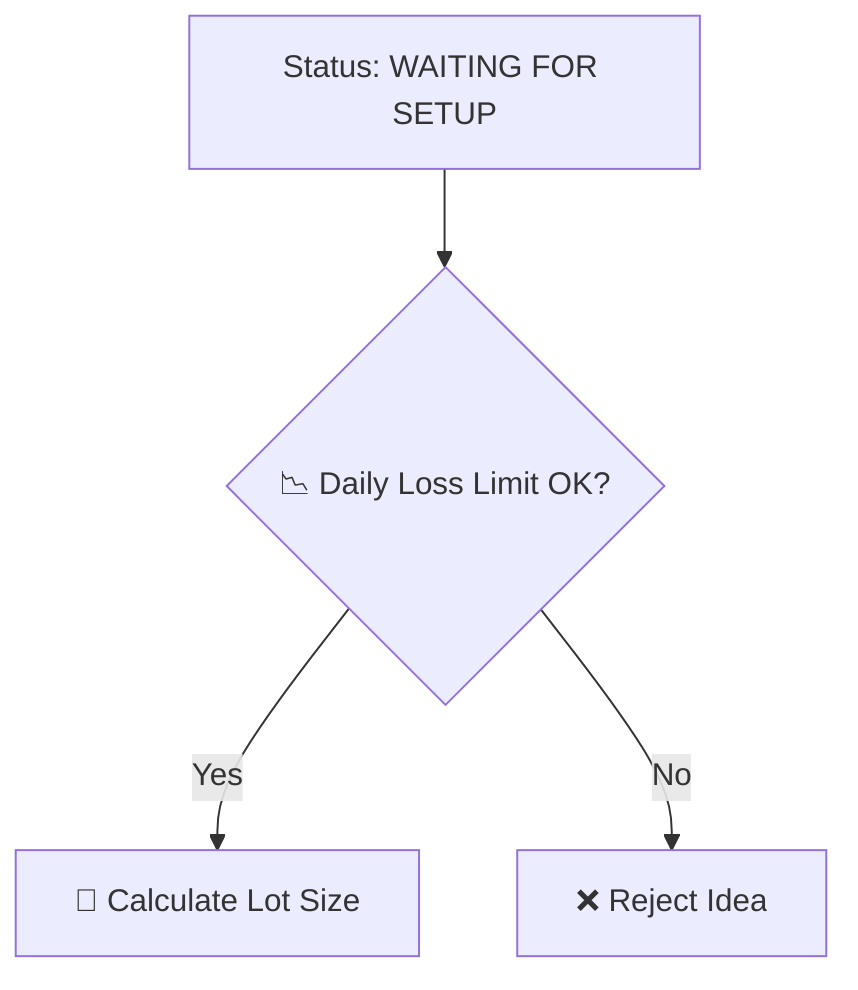
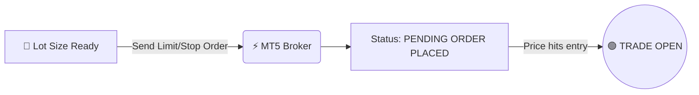
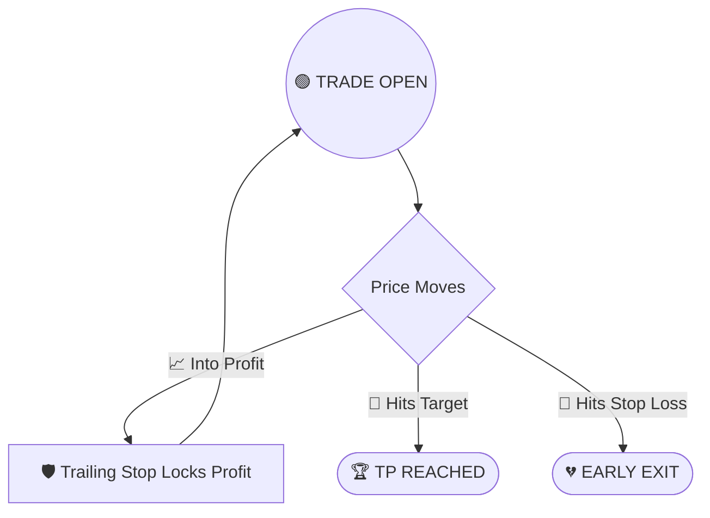
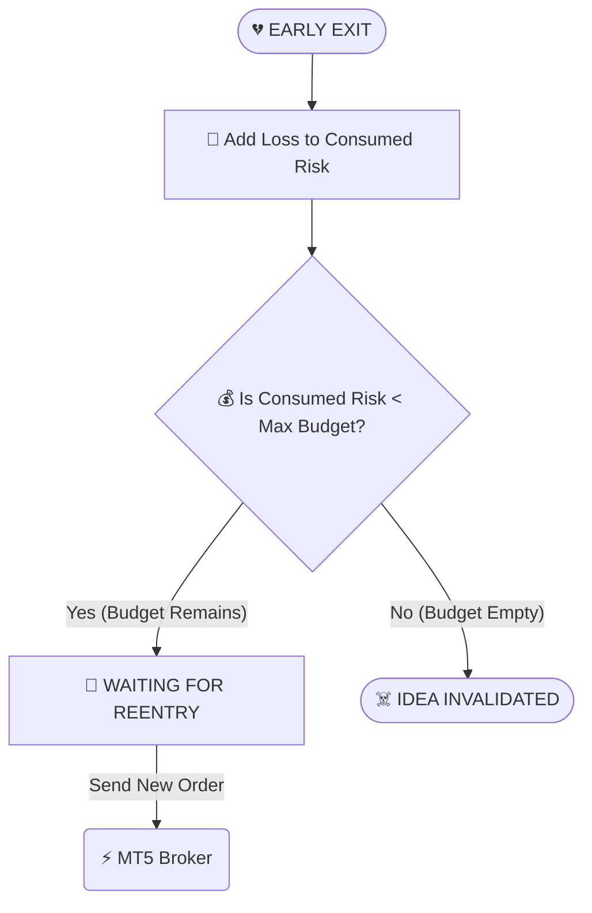

# 🗺️ Visual Map: How Your Trading System Works

Hello! I have redesigned this guide to be highly visual. We will use small diagrams and short bullet points to show how an idea moves through the system.

***

## 1️⃣ The Signal Arrives
How a new trading idea gets into the system.

* 📡 **External Source** sends a signal to your API.
* 🛡️ **API checks math** (e.g., is Stop Loss below Buy Price?).
* 💾 **Saves to Database** as a new idea.

***

## 2️⃣ Checking Risk & Sizing
Before doing anything, the bot makes sure the trade is safe.

* 📉 **Checks Daily Loss** (Have we lost too much today?).
* 📏 **Calculates Lot Size** based on your exact Risk Budget.

***

## 3️⃣ Placing the Order (Zero Latency)
The bot hands the job over to MT5 immediately.

* ⚡ **Sends Pending Order** directly to MT5.
* 👁️ **Monitors** MT5 to see if it fills.

***

## 4️⃣ Active Trade Management
Once the trade is open, the bot protects your profit.

* 🛡️ **Trailing Stop** moves up to lock in profit.
* 🎯 **Take Profit** closes for a win.
* 🛑 **Stop Loss** closes for a loss.

***

## 5️⃣ Whipsaw Recovery (The Safety Net)
What happens if the trade hits the Stop Loss?

* 🧮 **Calculate Loss:** How many dollars did we lose?
* 💰 **Check Budget:** Do we still have money left in the idea's Risk Budget?
* 🔄 **Try Again:** If budget remains, try the trade again.
* ☠️ **Permanent Kill:** If budget is empty, kill the idea forever.

